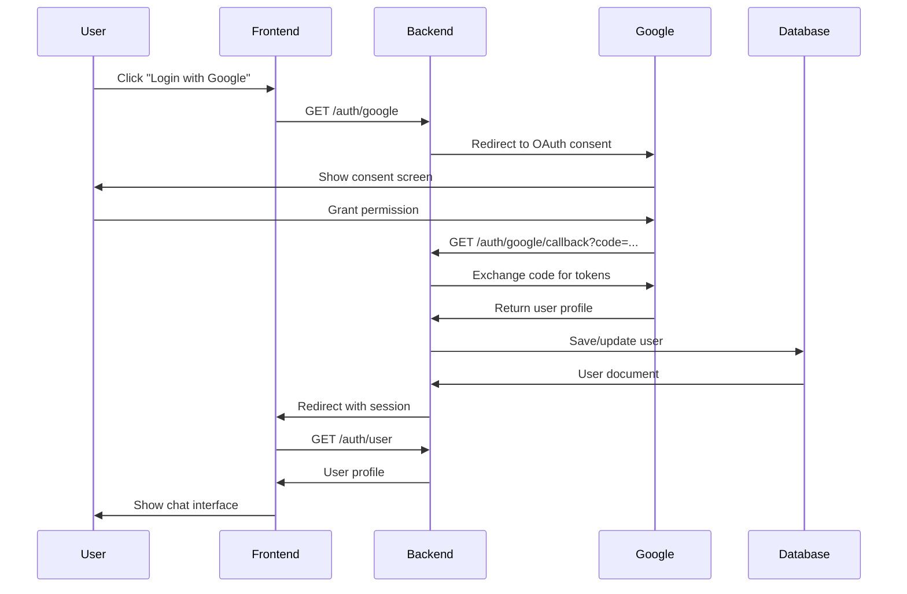

# Chat Application Documentation

## Table of Contents
1. [Overview](#overview)
2. [Architecture](#architecture)
3. [Features](#features)
4. [Technology Stack](#technology-stack)
5. [Database Design](#database-design)
6. [API Documentation](#api-documentation)
7. [Socket Events](#socket-events)
8. [Frontend Architecture](#frontend-architecture)
9. [Backend Architecture](#backend-architecture)
10. [Authentication Flow](#authentication-flow)
11. [File Upload System](#file-upload-system)
12. [Real-time Features](#real-time-features)
13. [Deployment Guide](#deployment-guide)
14. [Security Considerations](#security-considerations)

## Overview

The Chat Application is a modern, real-time messaging platform that enables users to communicate in multiple chat rooms. Built with a focus on user experience and scalability, it provides features like instant messaging, image sharing, user authentication, and room management.

### Key Characteristics
- **Real-time Communication**: Instant message delivery using WebSocket technology
- **Multi-room Support**: Users can join multiple chat rooms simultaneously
- **Secure Authentication**: Google OAuth 2.0 integration for secure login
- **Media Sharing**: Image upload and sharing capabilities
- **Responsive Design**: Works seamlessly across desktop and mobile devices
- **Scalable Architecture**: Designed to handle multiple concurrent users

## Architecture

### High-Level Architecture

```
┌─────────────────┐    HTTP/WS     ┌─────────────────┐    MongoDB    ┌─────────────────┐
│                 │   Requests     │                 │   Queries     │                 │
│  React Frontend │◄──────────────►│  Node.js Server │◄─────────────►│  MongoDB Atlas  │
│    (Port 5173)  │                │   (Port 5000)   │               │   (Cloud)       │
└─────────────────┘                └─────────────────┘               └─────────────────┘
         │                                   │
         │          Socket.io                │
         └───────────Real-time───────────────┘
              WebSocket Connection
```

### Project Structure

```
Chat App/
├── Frontend (React + Vite)
│   ├── src/
│   │   ├── components/
│   │   │   ├── Chat.jsx (Main container)
│   │   │   ├── MessageList.jsx (Message display)
│   │   │   ├── MessageInput.jsx (Message composition)
│   │   │   ├── RoomList.jsx (Room management)
│   │   │   ├── UserList.jsx (Online users)
│   │   │   ├── Login.jsx (Google login button)
│   │   │   └── LoginPage.jsx (Authentication page)
│   │   ├── contexts/
│   │   │   ├── AuthContext.jsx (User state provider)
│   │   │   ├── AuthContextDefinition.js (Auth context definition)
│   │   │   ├── SocketContext.jsx (WebSocket provider)
│   │   │   ├── SocketContextDefinition.js (Socket context definition)
│   │   │   ├── useAuth.js (Authentication hook)
│   │   │   └── useSocket.js (Socket management hook)
│   │   ├── utils/ (Utility functions)
│   │   ├── assets/ (Static assets)
│   │   ├── App.jsx (Main app component)
│   │   ├── main.jsx (React entry point)
│   │   └── index.css (Global styles)
│   ├── public/ (Static files)
│   ├── package.json
│   └── vite.config.js
└── server/ (Node.js Backend)
    ├── models/
    │   ├── User.js (User schema)
    │   ├── Room.js (Room schema)
    │   └── Message.js (Message schema)
    ├── config/
    │   └── passport.js (OAuth configuration)
    ├── routes/ (API endpoints)
    ├── uploads/ (File storage)
    ├── index.js (Main server file)
    ├── package.json
    └── .env (Environment variables)
```

## Features

### Core Features

#### 1. User Authentication
- **Google OAuth 2.0**: Secure third-party authentication
- **Session Management**: Persistent login sessions with MongoDB store
- **Automatic Logout**: Session expiration handling

#### 2. Real-time Messaging
- **Instant Delivery**: Messages appear immediately for all users
- **Typing Indicators**: Visual feedback when users are typing
- **Message History**: Persistent message storage and retrieval
- **Optimistic Updates**: Immediate UI updates for better UX

#### 3. Room Management
- **Default Rooms**: Pre-configured public rooms (General, Random, Tech Talk, Help & Support)
- **Custom Rooms**: Users can create new chat rooms
- **Join/Leave System**: Explicit room membership management
- **Auto-cleanup**: Empty non-default rooms are automatically deleted
- **Search Functionality**: Find rooms by name or description

#### 4. Media Sharing
- **Image Upload**: Support for JPEG, PNG, GIF formats
- **File Size Limit**: Maximum 10MB per image
- **Secure Storage**: Files stored on server with unique naming
- **Direct Display**: Images displayed inline in chat

#### 5. User Experience
- **Online Status**: Real-time user presence indicators
- **Notifications**: Browser and sound notifications for new messages
- **Responsive Design**: Mobile and desktop optimized
- **Dark/Light Theme**: Modern UI with Tailwind CSS

### Advanced Features

#### 1. Room Membership System
```javascript
// Users must join rooms before chatting
const joinRoom = async (roomId) => {
  // Add user to room members
  // Enable message sending/receiving
  // Start receiving notifications
}
```

#### 2. Message Filtering
- Only room members can send messages
- Only room members can view message history
- Real-time permission checking

#### 3. Automatic Cleanup
```javascript
// Runs every 30 minutes
const cleanupEmptyRooms = () => {
  // Find rooms with 0 members
  // Exclude default rooms
  // Delete room and associated messages
}
```

## Technology Stack

### Frontend Technologies

| Technology | Version | Purpose |
|------------|---------|---------|
| React | 18.x | UI Framework |
| Vite | 7.x | Build Tool & Dev Server |
| Tailwind CSS | 3.x | Styling Framework |
| Socket.io Client | 4.x | Real-time Communication |
| Axios | 1.x | HTTP Client |

### Backend Technologies

| Technology | Version | Purpose |
|------------|---------|---------|
| Node.js | 18.x+ | Runtime Environment |
| Express.js | 4.x | Web Framework |
| Socket.io | 4.x | WebSocket Server |
| MongoDB | 6.x | Database |
| Mongoose | 8.x | ODM |
| Passport.js | 0.7.x | Authentication |
| Multer | 1.x | File Upload |
| Express-Session | 1.x | Session Management |
| Connect-Mongo | 5.x | Session Store |

## Database Design

### Schema Overview

```javascript
// User Schema
{
  _id: ObjectId,
  googleId: String,
  name: String,
  email: String,
  avatar: String,
  isOnline: Boolean,
  lastSeen: Date,
  createdAt: Date,
  updatedAt: Date
}

// Room Schema
{
  _id: ObjectId,
  name: String,
  description: String,
  createdBy: ObjectId (ref: User),
  members: [ObjectId] (ref: User),
  isActive: Boolean,
  isDefault: Boolean,
  createdAt: Date,
  updatedAt: Date
}

// Message Schema
{
  _id: ObjectId,
  content: String,
  user: ObjectId (ref: User),
  room: ObjectId (ref: Room),
  messageType: String, // 'text' | 'image'
  image: {
    filename: String,
    originalName: String,
    mimetype: String,
    size: Number,
    url: String
  },
  isEdited: Boolean,
  editedAt: Date,
  createdAt: Date,
  updatedAt: Date
}
```

### Relationships

```
User (1) ─── creates ──► (N) Room
User (N) ◄── members ──► (N) Room
User (1) ─── sends ────► (N) Message
Room (1) ◄── contains ── (N) Message
```

### Indexes

```javascript
// Performance optimization indexes
User: { googleId: 1 }, { email: 1 }
Room: { name: 1 }, { isDefault: 1, members: 1 }
Message: { room: 1, createdAt: 1 }, { user: 1 }
```

## API Documentation

### Authentication Endpoints

#### `GET /auth/google`
**Description**: Initiates Google OAuth flow
**Response**: Redirects to Google OAuth consent screen

#### `GET /auth/google/callback`
**Description**: Handles Google OAuth callback
**Response**: Redirects to frontend with authentication status

#### `GET /auth/logout`
**Description**: Logs out current user
**Response**: 
```json
{ "message": "Logged out successfully" }
```

#### `GET /auth/user`
**Description**: Gets current authenticated user
**Response**:
```json
{
  "_id": "...",
  "name": "John Doe",
  "email": "john@example.com",
  "avatar": "https://..."
}
```

### Room Management Endpoints

#### `GET /api/rooms`
**Description**: Retrieves all active rooms
**Authentication**: Required
**Response**:
```json
[
  {
    "_id": "...",
    "name": "General",
    "description": "General discussion",
    "members": [...],
    "isDefault": true
  }
]
```

#### `POST /api/rooms`
**Description**: Creates a new room
**Authentication**: Required
**Body**:
```json
{
  "name": "My Room",
  "description": "Room description"
}
```
**Response**:
```json
{
  "_id": "...",
  "name": "My Room",
  "description": "Room description",
  "createdBy": "...",
  "members": ["..."]
}
```

#### `POST /api/rooms/:roomId/join`
**Description**: Joins a room
**Authentication**: Required
**Response**:
```json
{
  "message": "Joined room successfully",
  "room": { ... }
}
```

#### `POST /api/rooms/:roomId/leave`
**Description**: Leaves a room
**Authentication**: Required
**Response**:
```json
{
  "message": "Left room successfully",
  "room": { ... },
  "roomDeleted": false
}
```

### Message Endpoints

#### `GET /api/rooms/:roomId/messages`
**Description**: Retrieves room messages
**Authentication**: Required
**Authorization**: Must be room member
**Response**:
```json
[
  {
    "_id": "...",
    "content": "Hello!",
    "user": {
      "_id": "...",
      "name": "John Doe",
      "avatar": "..."
    },
    "room": "...",
    "messageType": "text",
    "createdAt": "2025-01-01T00:00:00.000Z"
  }
]
```

### File Upload Endpoint

#### `POST /api/upload`
**Description**: Uploads an image file
**Authentication**: Required
**Content-Type**: `multipart/form-data`
**Body**: `image` file field
**File Limits**: Max 10MB, JPEG/PNG/GIF only
**Response**:
```json
{
  "filename": "image-1234567890123-456789012.jpeg",
  "originalName": "photo.jpeg",
  "mimetype": "image/jpeg",
  "size": 1048576,
  "url": "/uploads/image-1234567890123-456789012.jpeg"
}
```

## Socket Events

### Client to Server Events

#### `user-connected`
**Description**: Registers user connection
**Payload**:
```javascript
socket.emit('user-connected', userId);
```

#### `join-room`
**Description**: Joins a Socket.io room
**Payload**:
```javascript
socket.emit('join-room', roomId);
```

#### `leave-room`
**Description**: Leaves a Socket.io room
**Payload**:
```javascript
socket.emit('leave-room', roomId);
```

#### `send-message`
**Description**: Sends a message to a room
**Payload**:
```javascript
socket.emit('send-message', {
  content: "Hello world!",
  roomId: "...",
  userId: "...",
  image: null // or image object for image messages
});
```

#### `typing`
**Description**: Indicates user is typing
**Payload**:
```javascript
socket.emit('typing', {
  roomId: "...",
  userId: "...",
  username: "John Doe"
});
```

#### `stop-typing`
**Description**: Indicates user stopped typing
**Payload**:
```javascript
socket.emit('stop-typing', {
  roomId: "...",
  userId: "..."
});
```

### Server to Client Events

#### `new-message`
**Description**: New message received
**Payload**:
```javascript
{
  "_id": "...",
  "content": "Hello!",
  "user": { ... },
  "room": "...",
  "messageType": "text",
  "createdAt": "..."
}
```

#### `message-error`
**Description**: Message sending error
**Payload**:
```javascript
{
  "error": "You must join the room to send messages"
}
```

#### `user-typing`
**Description**: User typing notification
**Payload**:
```javascript
{
  "userId": "...",
  "username": "John Doe"
}
```

#### `user-stop-typing`
**Description**: User stopped typing notification
**Payload**:
```javascript
{
  "userId": "..."
}
```

#### `user-status-changed`
**Description**: User online status changed
**Payload**:
```javascript
{
  "userId": "...",
  "isOnline": true
}
```

## Frontend Architecture

### Component Hierarchy

```
App.jsx
├── AuthProvider
│   ├── SocketProvider
│   │   ├── LoginPage (if not authenticated)
│   │   └── Chat (if authenticated)
│   │       ├── UserProfile
│   │       ├── RoomList
│   │       │   ├── SearchInput
│   │       │   ├── CreateRoomForm
│   │       │   └── RoomItem[]
│   │       ├── MessageList
│   │       │   ├── MessageItem[]
│   │       │   └── TypingIndicator
│   │       ├── MessageInput
│   │       │   ├── TextInput
│   │       │   └── ImageUpload
│   │       └── UserList
│   │           └── OnlineUser[]
```

### State Management

#### AuthContext
```javascript
const AuthContext = {
  user: User | null,
  isLoading: boolean,
  login: () => void,
  logout: () => void
}
```

#### SocketContext
```javascript
const SocketContext = {
  socket: Socket | null,
  isConnected: boolean,
  connect: () => void,
  disconnect: () => void
}
```

### Custom Hooks

#### useAuth Hook
```javascript
const useAuth = () => {
  const { user, isLoading, login, logout } = useContext(AuthContext);
  return { user, isLoading, login, logout };
}
```

#### useSocket Hook
```javascript
const useSocket = () => {
  const { socket, isConnected } = useContext(SocketContext);
  return { socket, isConnected };
}
```

### Component Communication

```
Chat.jsx (State Manager)
├── rooms[] ──────────────► RoomList
├── currentRoom ─────────► RoomList, MessageList, MessageInput
├── messages[] ──────────► MessageList
├── onlineUsers[] ───────► UserList
├── handleSendMessage ──► MessageInput
├── handleRoomSelect ───► RoomList
└── handleJoinRoom ─────► RoomList
```

## Backend Architecture

### Express Server Structure

```javascript
// Main server file (index.js)
const app = express();
const server = http.createServer(app);
const io = socketIo(server);

// Middleware setup
app.use(cors());
app.use(express.json());
app.use(session());
app.use(passport.initialize());
app.use(passport.session());

// Routes
app.use('/auth', authRoutes);
app.use('/api', apiRoutes);

// Socket.io setup
io.on('connection', handleConnection);
```

### Middleware Stack

1. **CORS**: Cross-origin resource sharing
2. **Body Parser**: JSON request parsing
3. **Session**: Express session with MongoDB store
4. **Passport**: Authentication middleware
5. **Static Files**: Serve uploaded images
6. **Multer**: File upload handling

### Socket.io Connection Handling

```javascript
io.on('connection', (socket) => {
  // Connection tracking
  const connectedUsers = new Map();
  
  // Event handlers
  socket.on('user-connected', handleUserConnected);
  socket.on('join-room', handleJoinRoom);
  socket.on('leave-room', handleLeaveRoom);
  socket.on('send-message', handleSendMessage);
  socket.on('typing', handleTyping);
  socket.on('stop-typing', handleStopTyping);
  socket.on('disconnect', handleDisconnect);
});
```

### Error Handling

```javascript
// Global error handler
app.use((err, req, res, next) => {
  console.error(err.stack);
  res.status(500).json({ 
    error: 'Something went wrong!',
    message: process.env.NODE_ENV === 'development' ? err.message : undefined
  });
});

// Socket error handling
socket.on('error', (error) => {
  console.error('Socket error:', error);
  socket.emit('error', { message: 'Connection error occurred' });
});
```

## Authentication Flow

### Google OAuth 2.0 Flow



### Session Management

```javascript
// Session configuration
app.use(session({
  secret: process.env.SESSION_SECRET,
  resave: false,
  saveUninitialized: false,
  name: 'chatapp.session',
  store: MongoStore.create({
    mongoUrl: process.env.MONGODB_URI,
    touchAfter: 24 * 3600
  }),
  cookie: {
    secure: false, // true in production with HTTPS
    httpOnly: true,
    maxAge: 7 * 24 * 60 * 60 * 1000, // 7 days
    sameSite: 'lax'
  }
}));
```

### Passport Configuration

```javascript
// Google OAuth strategy
passport.use(new GoogleStrategy({
  clientID: process.env.GOOGLE_CLIENT_ID,
  clientSecret: process.env.GOOGLE_CLIENT_SECRET,
  callbackURL: "/auth/google/callback"
}, async (accessToken, refreshToken, profile, done) => {
  try {
    let user = await User.findOne({ googleId: profile.id });
    
    if (user) {
      // Update existing user
      user.lastSeen = new Date();
      await user.save();
      return done(null, user);
    } else {
      // Create new user
      user = new User({
        googleId: profile.id,
        name: profile.displayName,
        email: profile.emails[0].value,
        avatar: profile.photos[0].value
      });
      await user.save();
      return done(null, user);
    }
  } catch (error) {
    return done(error, null);
  }
}));
```

## File Upload System

### Multer Configuration

```javascript
const storage = multer.diskStorage({
  destination: (req, file, cb) => {
    cb(null, 'uploads/');
  },
  filename: (req, file, cb) => {
    const uniqueSuffix = Date.now() + '-' + Math.round(Math.random() * 1E9);
    cb(null, file.fieldname + '-' + uniqueSuffix + path.extname(file.originalname));
  }
});

const upload = multer({
  storage,
  limits: {
    fileSize: 10 * 1024 * 1024 // 10MB
  },
  fileFilter: (req, file, cb) => {
    if (file.mimetype.startsWith('image/')) {
      cb(null, true);
    } else {
      cb(new Error('Only image files are allowed!'), false);
    }
  }
});
```

### File Serving

```javascript
// Static file serving with CORS
app.use('/uploads', (req, res, next) => {
  res.header('Access-Control-Allow-Origin', process.env.CLIENT_URL);
  res.header('Access-Control-Allow-Methods', 'GET');
  res.header('Access-Control-Allow-Headers', 'Origin, X-Requested-With, Content-Type, Accept');
  next();
}, express.static(path.join(__dirname, 'uploads')));
```

### Image Processing Flow

```
User selects image
      ↓
Frontend validation (type, size)
      ↓
FormData creation
      ↓
POST /api/upload
      ↓
Multer processing
      ↓
File saved to uploads/
      ↓
Database metadata saved
      ↓
URL returned to frontend
      ↓
Message sent with image URL
      ↓
Image displayed in chat
```

## Real-time Features

### Socket.io Implementation

#### Connection Management
```javascript
const connectedUsers = new Map();

socket.on('user-connected', async (userId) => {
  connectedUsers.set(socket.id, userId);
  
  // Update user online status
  await User.findByIdAndUpdate(userId, {
    isOnline: true,
    lastSeen: new Date()
  });
  
  // Broadcast online status
  socket.broadcast.emit('user-status-changed', {
    userId,
    isOnline: true
  });
});
```

#### Message Broadcasting
```javascript
socket.on('send-message', async (data) => {
  try {
    const { content, roomId, userId, image } = data;
    
    // Verify room membership
    const room = await Room.findById(roomId);
    if (!room.members.includes(userId)) {
      socket.emit('message-error', { 
        error: 'You must join the room to send messages' 
      });
      return;
    }
    
    // Save message
    const message = new Message({
      content,
      user: userId,
      room: roomId,
      image,
      messageType: image ? 'image' : 'text'
    });
    
    await message.save();
    await message.populate('user', 'name avatar');
    
    // Broadcast to room members
    io.to(roomId).emit('new-message', message);
  } catch (error) {
    socket.emit('message-error', { error: 'Failed to send message' });
  }
});
```

#### Typing Indicators
```javascript
const typingUsers = new Map(); // roomId -> Set of userIds

socket.on('typing', (data) => {
  const { roomId, userId, username } = data;
  
  if (!typingUsers.has(roomId)) {
    typingUsers.set(roomId, new Set());
  }
  
  typingUsers.get(roomId).add(userId);
  
  socket.to(roomId).emit('user-typing', { userId, username });
  
  // Auto-clear typing after 3 seconds
  setTimeout(() => {
    if (typingUsers.has(roomId)) {
      typingUsers.get(roomId).delete(userId);
      socket.to(roomId).emit('user-stop-typing', { userId });
    }
  }, 3000);
});
```

### Optimistic Updates

Frontend implementation for immediate UI feedback:

```javascript
const handleSendMessage = (content, image = null) => {
  // Create optimistic message
  const optimisticMessage = {
    _id: `temp-${Date.now()}`,
    content,
    user: {
      _id: user._id,
      name: user.name,
      avatar: user.avatar
    },
    room: currentRoom._id,
    image,
    messageType: image ? 'image' : 'text',
    createdAt: new Date().toISOString(),
    isOptimistic: true
  };

  // Add to UI immediately
  setMessages(prev => [...prev, optimisticMessage]);

  // Send to server
  socket.emit('send-message', {
    content,
    roomId: currentRoom._id,
    userId: user._id,
    image
  });
};
```

## Deployment Guide

### Environment Setup

#### Development
```bash
# Frontend
npm run dev     # Vite dev server on port 5173

# Backend
npm start       # Node.js server on port 5000
```

#### Production Build
```bash
# Frontend
npm run build   # Creates dist/ folder
npm run preview # Preview production build

# Backend
npm start       # Production server
```

### Environment Variables

#### Frontend (.env)
```env
VITE_API_URL=http://localhost:5000
VITE_SOCKET_URL=http://localhost:5000
```

#### Backend (.env)
```env
NODE_ENV=production
PORT=5000
MONGODB_URI=mongodb+srv://...
GOOGLE_CLIENT_ID=your_client_id
GOOGLE_CLIENT_SECRET=your_client_secret
SESSION_SECRET=your_session_secret
CLIENT_URL=https://your-frontend-domain.com
```

### Deployment Platforms

#### Frontend Deployment (Vercel/Netlify)
```bash
# Build command
npm run build

# Output directory
dist

# Environment variables
VITE_API_URL=https://your-backend-domain.com
VITE_SOCKET_URL=https://your-backend-domain.com
```

#### Backend Deployment (Railway/Heroku)
```bash
# Start command
npm start

# Required environment variables
MONGODB_URI
GOOGLE_CLIENT_ID
GOOGLE_CLIENT_SECRET
SESSION_SECRET
CLIENT_URL
```

### MongoDB Atlas Setup

1. Create cluster
2. Configure network access (IP whitelist)
3. Create database user
4. Get connection string
5. Configure environment variable

### Google OAuth Setup

1. Go to Google Cloud Console
2. Create/select project
3. Enable Google+ API
4. Create OAuth 2.0 credentials
5. Add authorized redirect URIs:
   - Development: `http://localhost:5000/auth/google/callback`
   - Production: `https://your-domain.com/auth/google/callback`

## Security Considerations

### Authentication Security

#### OAuth 2.0 Best Practices
- Secure client secret storage
- HTTPS-only in production
- Proper redirect URI validation
- State parameter for CSRF protection

#### Session Security
```javascript
cookie: {
  secure: process.env.NODE_ENV === 'production', // HTTPS only
  httpOnly: true, // Prevent XSS
  maxAge: 7 * 24 * 60 * 60 * 1000, // 7 days
  sameSite: 'lax' // CSRF protection
}
```

### File Upload Security

#### Validation
- File type validation (mimetype checking)
- File size limits (10MB max)
- Filename sanitization
- Virus scanning (recommended for production)

#### Storage Security
```javascript
// Secure filename generation
const uniqueSuffix = Date.now() + '-' + Math.round(Math.random() * 1E9);
const filename = file.fieldname + '-' + uniqueSuffix + path.extname(file.originalname);
```

### Database Security

#### Input Validation
- Mongoose schema validation
- Request payload sanitization
- SQL injection prevention (NoSQL injection)

#### Access Control
- Authentication required for all protected routes
- Room membership validation
- User authorization checks

### CORS Configuration

```javascript
app.use(cors({
  origin: process.env.CLIENT_URL || "http://localhost:5173",
  credentials: true,
  methods: ['GET', 'POST', 'PUT', 'DELETE'],
  allowedHeaders: ['Content-Type', 'Authorization']
}));
```

### Rate Limiting (Recommended)

```javascript
const rateLimit = require('express-rate-limit');

const limiter = rateLimit({
  windowMs: 15 * 60 * 1000, // 15 minutes
  max: 100, // limit each IP to 100 requests per windowMs
  message: 'Too many requests from this IP'
});

app.use('/api/', limiter);
```

---

## Conclusion

This documentation provides a comprehensive overview of the Chat Application's architecture, features, and implementation details. The application demonstrates modern web development practices with real-time communication, secure authentication, and scalable design patterns.

For additional questions or contributions, please refer to the project's GitHub repository or contact the development team.
